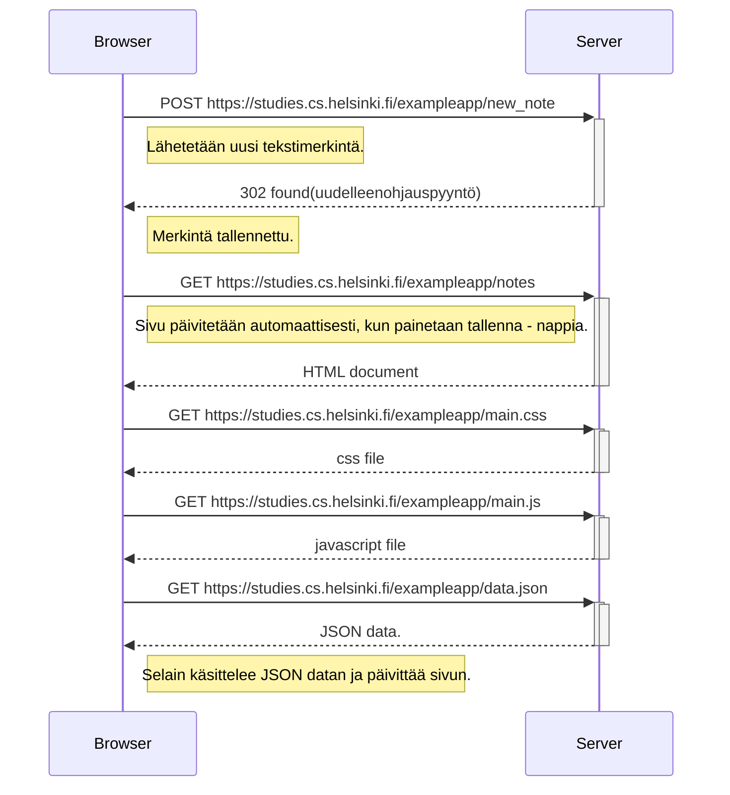

```mermaid
sequenceDiagram;

participant Browser
participant Server

Browser->>+Server: POST https://studies.cs.helsinki.fi/exampleapp/new_note
Note right of Browser: Lähetetään uusi tekstimerkintä.
Server-->>-Browser: 302 found(uudelleenohjauspyyntö)
Note right of Browser: Merkintä tallennettu.

Browser->>+Server: GET https://studies.cs.helsinki.fi/exampleapp/notes
activate Server
Note right of Browser: Sivu päivitetään automaattisesti, kun painetaan tallenna - nappia.
Server-->>-Browser: HTML document
deactivate Server

Browser->>+Server: GET https://studies.cs.helsinki.fi/exampleapp/main.css
activate Server
Server-->>-Browser: css file
deactivate Server

Browser->>+Server: GET https://studies.cs.helsinki.fi/exampleapp/main.js
activate Server
Server-->>-Browser: javascript file
deactivate Server

Browser->>+Server: GET https://studies.cs.helsinki.fi/exampleapp/data.json
activate Server
Server-->>-Browser: JSON data.
deactivate Server
Note right of Browser: Selain käsittelee JSON datan ja päivittää sivun.
```